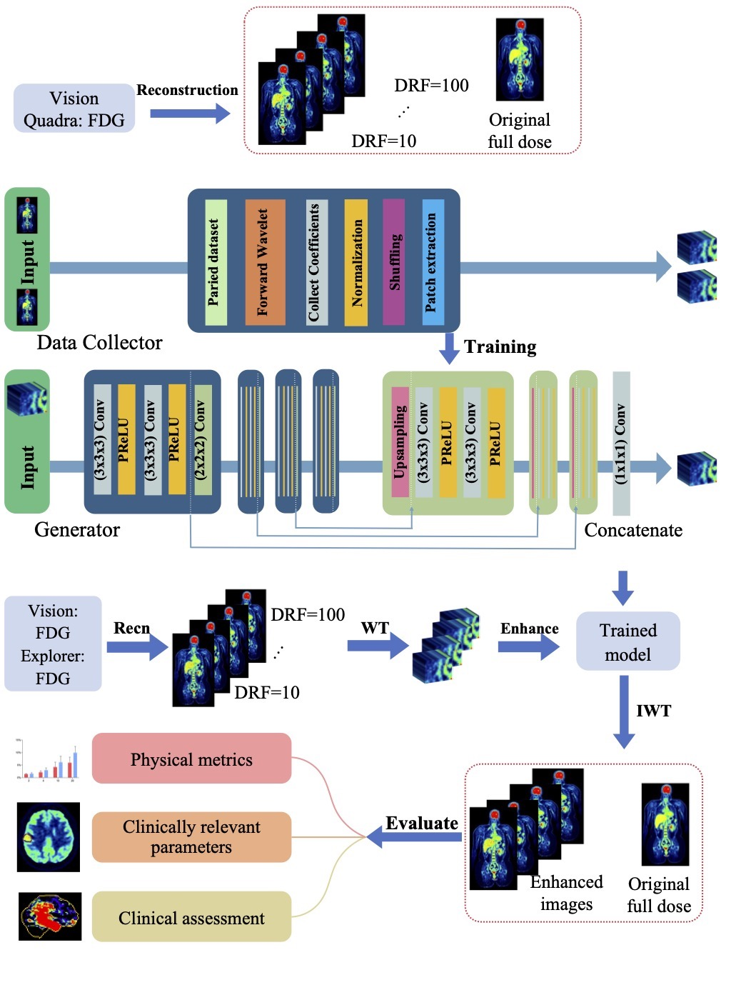

# wavelet-PET-denoising
This repository contains source code for enhancing `low-dose PET` (positron-emission-tomography) images 
using `3D-UNet` model on `wavelet` domain. Project initialized by ultra-low-dose PET
[Grand Challenge](https://ultra-low-dose-pet.grand-challenge.org/), and all clinical PET data are collected from the 
grand-challenge platform.

# Table of contents
1. [Introduction](#introduction)
2. [Installation](#installation)
3. [Dataset creation](#dataset-creation)
4. [Submit training](#submit-training)
5. [Model prediction](#prediction)
6. [Evaluation](#evaluation)

## Project introduction <a name="introduction"></a>
This project handles data & model workflow from training dataset preparation to model training, prediction and final
evaluation. All main components are implemented as Python classes, including:

* `DataLoader`: Handles functions and logic of creating training datasets from raw input PET images for baseline
model, `dataloader/baseline_data_loader.py`.
* Wavelet DataLoader: Handles functions and logic of creating training datasets from raw input PET images for wavelet 
model, `dataloader/wavelet_data_laoder.py`.
* SR_UnetGAN_3D: Contains the designed UNet-3D architecture and training
procedures, `networks/FCN_3D.py`.
* Predictor: Procedures of loading noisy PET image into test dataset and applying baseline model to the test, 
and processing transformations to acquire enhanced PET output, `prediction/baseline_inference.py`.
* WaveletPredictor: Procedures of loading noisy PET image into test dataset and applying wavelet model to the test, 
and processing transformations to acquire enhanced PET output,`prediction/wavelet_inference.py`
* Evaluator: Measures quality enhancement with respect to global and local metrics, `common/evaluation.py`.

A high-level architecture design is shown as follows:



## Installation <a name="installation"></a>
We use `Python=3.5.2` as main interpreter, based on which multiple deep-learning and data science packages are installed. 
Use the following commands to clone the project:
```
git clone https://github.com/felihong/wavelet-PET-denoising.git
cd wavelet-PET-denoising
```
Afterwards, install `virtualenv` to create a new virtual environment:
```
pip install virtualenv
virtualenv --python python3.5.2 venv
```
Activate the created environment and install all required packages:
```
source ~/virtualenv/venv/bin/activate
pip install -r requirements.txt
```

## Dataset creation <a name="dataset-creation"></a>
Both data loaders of baseline and wavelet models are wrapped into Python classes. One can use the following snippet to
create training dataset for `baseline` model, which is implemented in `DataLoader` class:
```
from dataloader.baseline_data_loader import DataLoader

# Init dataloader instance
data_loader = DataLoader(
    fulldose_dir, 
    lowdose_dirs,
    h5_file,
    h5_file_shuffled,
    compress_level=3,
    random_factor=0.5
)
# Start training dataset creation
data_loader.create_train_dataset(
    num_subject
)
# Index shuffling
data_loader.shuffle_train_dataset()
```

Similarly, the following signatures can be used to create dataset for `wavelet` model, using `WaveletDataLoader` class:
```
from dataloader.wavelet_data_loader import WaveletDataLoader

# Init wavelet dataloader instance
data_loader = WaveletDataLoader(
    fulldose_dir, 
    lowdose_dirs,
    h5_file,
    h5_file_shuffled,
    compress_level=3,
    random_factor=0.5
)
# Start training dataset creation
data_loader.create_train_dataset(
    coeff_type='detail',  # Or 'approx' for approximation dataset
    num_subject
)
# Index shuffling
data_loader.shuffle_train_dataset()
```
Below explains each of the key parameters in detail:
* `fulldose_dir`: Directory path containing original, full-dose PET nifti files in forms of PID.nii.gz
* `lowdose_dirs`: List of directories containing the respective noisy, low-dose PET nifti files, also in forms of PID.nii.gz
* `h5_file`: Path of HDF5 file to store intermediate non-shuffled array dataset
* `h5_file_shuffled`: Path pf HDF5 file for storing final, shuffled array dataset
* `compress_level`: Integer value ranging from 0 to 9, indicating the compression level of the H5 files
* `random_factor`: Float value ranging from 0.0 to 1.0, indicating the percentage of random values to be included in each of the axes.

## Submit training <a name="submit-training"></a>
Once the training dataset is prepared, one can submit the training jobs using the designed `3D-UNet` network:
```
from networks.FCN_3D import SR_UnetGAN_3D

unet = SR_UnetGAN_3D(
    data_path,
    save_dir,
    train_data_len,  
    val_data_len,    
    img_shape=(1, 64, 64, 64),
    epochs=100,
    batch_size=8,
    loss='mse',
    max_pooling=False,
    activation=None
)
unet.train()
```
And below explains each of the key parameters in detail:
* `data_path`: Path of HDF5 file containing training and validation dataset
* `save_dir`: Path to save model output
* `train_data_len`: Length of training dataset, can be checked using `check_size()` method of the data loader classes.
* `val_data_len`: Length of validation dataset. 
* `img_shape`: Shape of each of the 3D patch volume, by default (1, 64, 64, 64)
* `epochs`: Number of target epochs, by default 10
* `batch_size`: Size of each batch, by default 4
* `loss`: Loss function, by default MSE (L1)
* `max_pooling`: Boolean value indicating whether to use max pooling, by default False
* `activation`: Activation function, use `ReLu` if set to None. In case of wavelet detail model, it is recommended to 
use `PReLu` instead, as negative values are presented.

## Model prediction <a name="prediction"></a>


## Evaluation <a name="evaluation"></a>
The evaluation is performed according to both global (physical) and local (clinical) metrics, all metrics are measured 
based on which a final weighted score value is computed. Below table represents the evaluation metrics together with
intra-/inter group weights:

|                      | Metrics                             | Intra-group weights |
|----------------------|-------------------------------------|---------------------|
| Global metrics (50%) | NRMSE                               | 40%                 |
|                      | PSNR                                | 40%                 |
|                      | SSIM                                | 20%                 |
| Local metrics (50%)  | SUV_max                             | 20%                 |
|                      | SUV_mean                            | 20%                 |
|                      | PSNR                                | 15%                 |
|                      | Total Lesion Glycolysis             | 15%                 |
|                      | First order: RootMeanSquared        | 5%                  |
|                      | First order: 90Percentile           | 5%                  |
|                      | First order: Median                 | 5%                  |
|                      | GLRLM: High Gray Level Run Emphasis | 5%                  |
|                      | GLSZM: Zone Percentage              | 5%                  |
|                      | GLCM: Joint Average                 | 5%                  |


Having test dataset predicted, and the original full-dose images prepared, one needs to prepare mask images to leverage
local metrics. All tests should be labelled with ROI organs e.g. liver, heart, left kidney and right kidney.
A prepared test group should have the following structure:
```
|-- Test
|   |-- original
|   |   |-- PID_01.nii.gz
|   |   `-- PID_02.nii.gz
|   |-- prediction
|   |   |-- PID_01.nii.gz
|   |   `-- PID_02.nii.gz
|   |-- mask
|   |   |-- PID_01.nii.gz
|   |   `-- PID_02.nii.gz
|   `-- meta_info.csv
```

Having all required dataset prepared, one can start with the evaluation job as follows:
```
from common.evaluation import Evaluator

# Init evaluator instance
evaluator = Evaluator(
    real_dir,
    pred_dir,
    mask_dir,
    meta_info,
    output_path
)
# Evaluate all features
evaluator.evaluate_all()
```
where each of the parameters can be referenced as follows:
* `real_dir`: Path of directory containing original, full-dose test Nifti images
* `pred_dir`: Path of directory containing model predictions, in form of reconstructed Nifti images
* `mask_dir`: Path of directory containing organ RoI masks, in form of Nifti files
* `meta_info`: A csv file containing test subjects' metadata, including e.g. `scanner, PID, DRF, weight, dose`
* `output_path`: Optional, directory to save the csv evaluation report 
